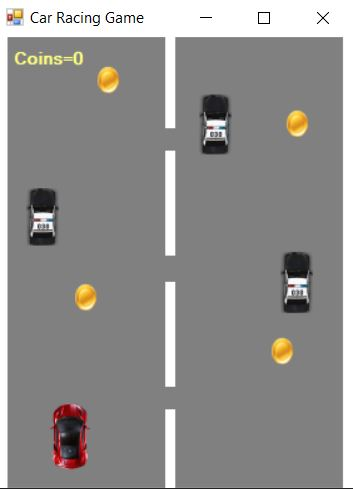

# Car Racing Game

Проектна задача по визуелно програмирање изработена од Анастасија Ѓорѓиевска.

***

## Опис на апликацијата

Оваа апликација претставува имплементација на едноставна игра со возење автомобил. Целта е да се избегне судар со полициските автомобили и притоа да се соберат што е можно повеќе парички. При судар со автомобил играта завршува.




Автомобилот се управува се управува со помош на стрелките на тастатурата. Со стрелката за право се забрзува автомобилот, со стрелката за назад се упорува и застанува автомобилот, а со стрелките за лево и десно се движи соодветно.

## Имплементација на апликацијата

Најпрво имаме функција за движење на линиите на патот. Доколку линијата дојде до 400 (што е должината на формата), се враќа на 0 односно почетокот.

```
if(line1.Top >= 400)
{
    line1.Top = 0;
}
else
{
    line1.Top += speed;
}
```
За контрола на автомобилот најпрво креиран е KeyDown event и поставени се контролите за соодветните стрелки од тастатура.

```
if(e.KeyCode == Keys.Left)
{
    if(car.Left > 0)
    car.Left += -8;
}
if(e.KeyCode == Keys.Right)
{
    if(car.Right < 290)
    car.Left += 8;
}
if(e.KeyCode == Keys.Up)
{
    if(gameSpeed < 14)
    gameSpeed++;
}
if(e.KeyCode == Keys.Down)
{
    if(gameSpeed > 0)
    gameSpeed--;
}
```

За движење на полициските автомобили употребен е сличен код како за движење на линиите, само што тука е искористена функцијата Random. Со помош на оваа функција при секој интервал автомобилите добиваат нови случајни вредности за х-координатата со што секојпат се појавуваат од различно место на екранот.
```
if(police1.Top >= 400)
{
    x = r.Next(0, 100);
    police1.Location = new Point(x, 0);
}
else
{
    police1.Top += speed;
}
```

На сличен начин се имплементирани и паричките.

За крај на играта имплементирана е функцијата gameOver(). Употребена е функцијата IntersectsWith и при допир на границите на нашиот автомобил со полициски автомобил играта завршува и ни се појавува Game Over лабела како и копче за рестарт.

```
if (car.Bounds.IntersectsWith(police1.Bounds))
{
    timer1.Enabled = false;
    gameOverLbl.Visible = true;
    restartbtn.Visible = true;
}
```

Функцијата IntersectsWith е употребена и за собирање на паричките, односно при допир на границите на нашиот автомобил со паричка се зголемува бројачот на паричките collectedCoins.
```
if (car.Bounds.IntersectsWith(coin1.Bounds))
{
    collectedCoins++;
    coinsLbl.Text = "Coins=" + collectedCoins.ToString();

    x = r.Next(59, 300);
    coin1.Location = new Point(x, 0);
}
```
